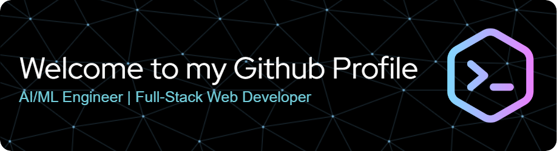

<!--
Sunirmal743/Sunirmal743 is a ✨ special ✨ repository because its `README.md` (this file) appears on your GitHub profile.
-->

  

<h1 align="center">
   I am Sunirmala Mohanta
</h1>

  

  
  
  

<h2 align="center">
  
  TECHNICAL EXPERTISE
  
</h2>

  
  
  
  
  

  
<h3>🧠 ARTIFICIAL INTELLIGENCE & MACHINE LEARNING</h3>

   
  

    <table>
      <tr>
        <td align="center"></td>
        <td align="center"></td>
        <td align="center"></td>
      </tr>
      <tr>
        <td align="center"></td>
        <td align="center"></td>
        <td align="center"></td>
      </tr>
    </table>
  

  
<h3>🌐 WEB DEVELOPMENT STACK</h3>

   
  

    <table>
      <tr>
        <td align="center"></td>
        <td align="center"></td>
        <td align="center"></td>
      </tr>
      <tr>
        <td align="center"></td>
        <td align="center"></td>
      </tr>
    </table>
  

  
<h3>🛠️ TOOLS & TECHNOLOGIES</h3>

   
  

    <table>
      <tr>
        <td align="center"></td>
        <td align="center"></td>
        <td align="center"></td>
      </tr>
      <tr>
        <td align="center"></td>
        <td align="center"></td>
      </tr>
    </table>
  

<h2 align="center">
  PROFESSIONAL FOCUS
</h2>

  <table>
    <tr>
      <td align="center">
        
         
        <b>Deep Learning</b>
      </td>
      <td align="center">
        
         
        <b>Full-Stack Web Dev</b>
      </td>
      <td align="center">
        
         
        <b>Computer Vision</b>
      </td>
      <td align="center">
        
         
        <b>NLP & Transformers</b>
      </td>
    </tr>
  </table>

  <h2>
    CURRENT ENDEAVORS
  </h2>

  <table>
    <tr>
      <td>👨‍💻 Researching</td>
      <td><b>Advanced Neural Architecture Design</b></td>
    </tr>
    <tr>
      <td>🌱 Learning</td>
      <td><b>Scalable Cloud-Native Applications</b></td>
    </tr>
    <tr>
      <td>🚀 Building</td>
      <td><b>Transformer Models & Generative AI</b></td>
    </tr>
    <tr>
      <td>🤝 Open to</td>
      <td><b>AI Research & Full-Stack Development Collaborations</b></td>
    </tr>
  </table>

  <h2>
    PROFESSIONAL NETWORK
  </h2>

  
  
  

  <h2>
    INSIGHT
  </h2>
  
"At the intersection of artificial intelligence and creative problem-solving, we find the most transformative technological solutions."

  
  

  

    
  

  
  

    
  

